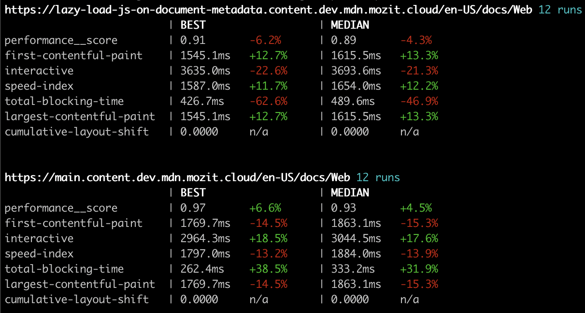

# speed-compete

A hacky wrapper to run [`lighthouse-batch`](https://www.npmjs.com/package/lighthouse-batch)
over and over to get a view of the best, average, and median on various
performance measurements.

## Screenshot



## How to use it

Create a file full of your URLs like:

```sh
▶ cat sites.txt
https://www.peterbe.com/lazy-loading-css/index.html
https://www.peterbe.com/lazy-loading-css/all-at-once.html

```

Then, just run `./run.sh` over and over. After each run, it'll spit out a
report. The more the merrier.
